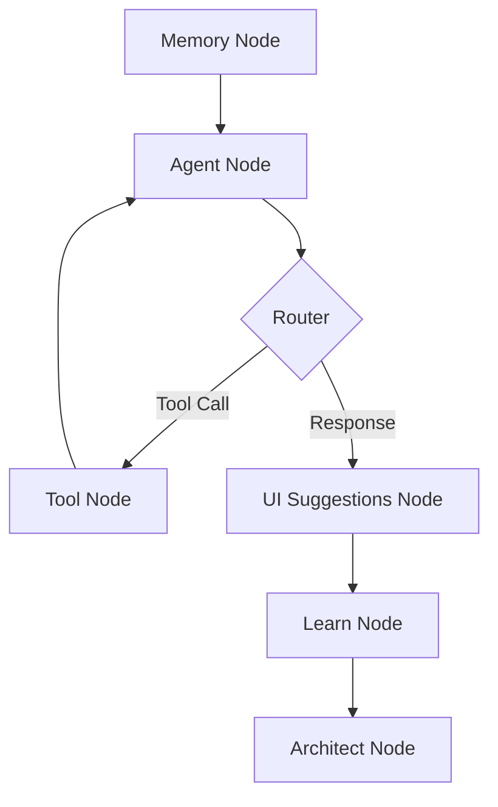
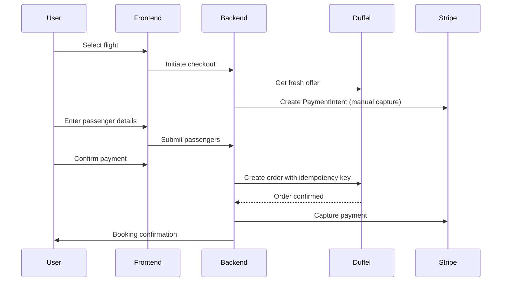

# SkySearch Project — Source of Truth

> [!IMPORTANT]
> **For All AI Agents**: This document is the Single Source of Truth for the SkySearch project. It reflects the **actual implementation state** against the original vision. Always read this first.

---

## 1. Project Overview

| **Attribute** | **Value** |
|---|---|
| **Name** | SkySearch (codenamed: TravoAI / FlightAggregator) |
| **Tagline** | The First Autonomous Travel Agent for Central Asia |
| **Core Mission** | Solve the fragmentation of travel to and within Uzbekistan by providing a single, trusted AI-native interface |
| **Current State** | MVP with Flights + Itinerary Generation |

### The Problem We're Solving
Travelers to Uzbekistan and Central Asia face "fragmented chaos":
- **Fragmentation**: A typical trip requires 5+ different sites (flights, hotels, railways, etc.)
- **Redirect Anxiety**: Users redirected to unknown 3rd-party sites → 90% drop-off due to fear of scams
- **Information Void**: Global giants (Skyscanner, Google) lack local context, payment options (Uzcard/Humo), and regional nuances
- **Static Data**: Users get data tables, not actionable advice or planning help

### The Solution Vision: "One-Click Magic"
SkySearch is NOT just a ChatGPT wrapper. It is an End-to-End Autonomous Agent that:
1. **Understands Context**: Deep local Uzbek knowledge, culture, and logistics
2. **Executes Transactions**: Acts as Merchant of Record — no redirects
3. **Integrates Locally**: Local payment systems (Uzcard, Humo) and services
4. **Plans Intelligently**: Turn "10 hours of planning into 10 minutes"

---

## 2. Implementation Status Dashboard

### ✅ IMPLEMENTED (Production-Ready)

| Feature | Status | Details |
|---------|--------|---------|
| **Conversational AI (Mira)** | ✅ Live | Full personality with travel confidant voice |
| **Flight Search & Booking** | ✅ Live | Via Duffel API with full booking flow |
| **Payment Processing** | ✅ Live | Stripe with authorize-capture flow |
| **Itinerary Generation** | ✅ Live | RAG-powered with Qdrant vector DB |
| **Visa Information** | ✅ Live | Tool-based visa checking by nationality |
| **User Memory** | ✅ Live | Semantic memory extraction + persistence |
| **Streaming Responses** | ✅ Live | Real-time SSE token streaming |
| **Conversation Persistence** | ✅ Live | Full chat history & session management |
| **Multi-language Awareness** | ✅ Live | System prompts reference Uzbek/Russian context |

### 🔄 PARTIAL / IN PROGRESS

| Feature | Status | Details |
|---------|--------|---------|
| **Local Knowledge Base** | 🔄 In Progress | Places data exists for cities (Tashkent, Samarkand, etc.) but needs enrichment |
| **Post-Booking Services** | 🔄 Basic | Suggestions exist but not fully integrated |

### ❌ NOT IMPLEMENTED (Roadmap)

| Feature | Status | Priority | Notes |
|---------|--------|----------|-------|
| **Hotel Search & Booking** | ❌ Missing | 🔴 High | No integration exists — only place categories mention "accommodation" |
| **Rail/Transport Integration** | ❌ Missing | 🔴 High | No Uzbekistan Railways or transport API |
| **Uzcard/Humo Payments** | ❌ Missing | 🔴 Critical | Only Stripe exists — no local Uzbek payment integration |
| **Proactive Flight Alerts** | ❌ Missing | 🟡 Medium | Price prediction/alerts not implemented |
| **Multi-language UI** | ❌ Missing | 🟡 Medium | AI speaks multiple languages but UI is English-only |

---

## 3. Technical Architecture

### Backend Stack
```
├── Framework: FastAPI (Python)
├── AI Orchestration: LangGraph with 7 nodes
├── LLM: OpenAI GPT-4 with streaming
├── Vector DB: Qdrant (local knowledge, semantic search)
├── Database: MySQL (via Railway)
├── Cache: Redis + In-memory TTL cache
├── Task Queue: Celery
├── Flight API: Duffel
├── Payments: Stripe (authorize-capture)
└── Deployment: Railway
```

### LangGraph Flow (7 Nodes)


**Node Responsibilities:**
1. **Memory Node**: Load user preferences + semantic memories from Qdrant
2. **Agent Node**: Main LLM with tool binding (GPT-4 streaming)
3. **Router**: Decide tool execution vs final response
4. **Tool Node**: Execute `plan_itinerary`, `search_flights`, `check_visa`
5. **UI Suggestions Node**: Generate smart suggestions without LLM
6. **Learn Node**: Background preference extraction
7. **Architect Node**: Itinerary generation with RAG grounding

### Available Tools
| Tool | Function | Implemented |
|------|----------|-------------|
| `plan_itinerary` | Generate RAG-grounded day-by-day plans | ✅ Yes |
| `search_flights` | Search Duffel API for flights | ✅ Yes |
| `check_visa` | Check visa requirements by nationality | ✅ Yes |
| `search_hotels` | Hotel search & booking | ❌ No |
| `search_transport` | Rail/bus booking | ❌ No |

### Frontend Stack
```
├── Framework: Next.js 15 (React)
├── Styling: Tailwind CSS
├── State: Zustand
├── Maps: MapLibre GL
├── SSE: Native EventSource for streaming
└── Deployment: Vercel-ready
```

### Key Frontend Components
```
src/components/
├── chat/          # ChatInput, ChatMessage, SuggestionChips
├── flights/       # FlightCard, FlightSearchPanel, DuffelFlightCard
├── panel/         # RightPanel, PassengerFormPanel, ConfirmationPanel
├── trips/         # Trip management
├── map/           # Interactive itinerary map
└── layout/        # App shell
```

---

## 4. AI Personality: Mira

### Identity
**Mira** is not a generic assistant but a "well-traveled friend who's genuinely excited to help people discover the world."

### Voice Characteristics
| Trait | Description |
|-------|-------------|
| **Warm & Real** | Talks like a friend who knows everything about travel |
| **Sensory Storyteller** | "Imagine the smell of fresh bread in a Parisian morning..." |
| **Confident Opinions** | "Trust me, skip the tourist trap" |
| **Energy Mirror** | Matches user's vibe (excited, stressed, etc.) |

### What Mira NEVER Does
- ❌ Sound like a search engine ("Here are 5 options...")
- ❌ Rush past dreaming to push bookings
- ❌ Give generic guidebook answers
- ❌ Say "I don't have personal experiences"
- ❌ Mention being an AI unless asked

### Conversation Modes
1. **Discovery**: Sell the dream — "Japan has this way of stopping you mid-step..."
2. **Narrowing Down**: Clarify details conversationally — "Love it! Tokyo chaos or Kyoto temples?"
3. **Architect**: Itinerary generation — MUST use `plan_itinerary` tool
4. **Flight Hunter**: Search immediately, present with personality
5. **Local Guide**: Answer like someone who's been there
6. **Visa Advisor**: Get passport nationality, call `check_visa`

---

## 5. Itinerary Engine (The Core Differentiator)

### Architecture: RETRIEVE → CLUSTER → GENERATE


### Key Features
- **100% Grounded**: Only uses verified places from database
- **Geographic Clustering**: KMeans on lat/lon for walkable daily plans
- **Insider Tips**: Surfaced from place data, never hallucinated
- **Transit Estimation**: Automatic walking/taxi/transit suggestions
- **Cover Images**: Google Places + Unsplash fallback

### Output Schema
```python
class GeneratedItinerary:
    trip_title: str
    city: str
    country_code: str
    summary: str
    days: List[DayItinerary]  # Each day has activities with times
    cultural_tips: List[str]
    places_used: int
    verified_places: int
```

---

## 6. Payment Flow (Current State)

### Implemented: Stripe Authorize-Capture


### NOT Implemented: Local Payments
- ❌ Uzcard integration
- ❌ Humo integration
- ❌ Click/Payme (Uzbek payment gateways)

> [!WARNING]
> **Critical Gap**: The pitch mentions Uzcard/Humo as a key differentiator, but zero code exists for these integrations.

---

## 7. Target Audience

| Segment | Description | Status |
|---------|-------------|--------|
| **Tech-Savvy Tourists** | Western travelers wanting convenient planning | ✅ Served by MVP |
| **Diaspora Travelers** | Uzbeks abroad visiting home | 🔄 Partial (no local payments) |
| **Local Uzbeks** | Uzbekistan residents booking domestic travel | ❌ Blocked (no Uzcard/Humo) |
| **Business Travelers** | Corporate travel to Central Asia | 🔄 Partial |

---

## 8. API Endpoints (Current)

| Category | Endpoints |
|----------|-----------|
| **Chat** | `/api/v1/chat/stream`, `/api/v1/conversations/*` |
| **Flights** | `/api/v1/duffel/*`, `/api/v1/bookings/*` |
| **Checkout** | `/api/v1/checkout/*` |
| **Trips** | `/api/v1/trips/*`, `/api/v1/itinerary/*` |
| **Places** | `/api/v1/places/*` |
| **Auth** | `/api/v1/auth/*`, `/api/v1/users/*` |
| **Utilities** | `/api/v1/airports/*`, `/api/v1/nearest-airport` |

---

## 9. Design System Requirements

### Frontend Vibe
- **Premium, trustworthy, state-of-the-art**
- **Chat-first interface** with rich embedded UI (cards, maps)
- Current implementation: Next.js + Tailwind + MapLibre

### Response Time Targets
| Operation | Target | Current |
|-----------|--------|---------|
| First token | <2s | ~2-3s |
| Full response | <5s | ~4-6s |
| Itinerary generation | <10s | ~8-15s |
| Flight search | <5s | ~3-5s |

### Tone of Voice
- **Helpful**: Genuinely wants to help
- **Confident**: Knows the region deeply
- **Hospitable**: Embodies Uzbek hospitality

---

## 10. Success Metrics

| Metric | Target | Current |
|--------|--------|---------|
| Redirect anxiety elimination | 100% | ✅ Achieved (Stripe inline) |
| Planning time reduction | 90% | ✅ Achieved for itineraries |
| Local payment adoption | Target 40% | ❌ 0% (not implemented) |
| Booking completion rate | >70% | TBD |

---

## 11. Roadmap Priorities

### Phase 1: Local Payments (CRITICAL)
1. Integrate Uzcard payment gateway
2. Integrate Humo payment gateway
3. Add Click/Payme as fallback

### Phase 2: Hotels
1. Research hotel aggregator APIs (Booking.com affiliate, Ostrovok, etc.)
2. Implement hotel search tool
3. Add hotel recommendations to itineraries

### Phase 3: Rail & Transport
1. Integrate Uzbekistan Railways API (if available)
2. Add inter-city transport recommendations
3. Include transport in itinerary flow

### Phase 4: Enhancements
1. Price prediction/alerts
2. Multi-language UI
3. Mobile app (React Native)

---

## 12. File Structure Reference

```
FlightAggregator 2/
├── app/
│   ├── langgraph_flow/    # AI orchestration
│   │   ├── graph.py       # Main LangGraph definition
│   │   ├── state.py       # Conversation state
│   │   └── nodes/         # All 7 nodes
│   ├── services/          # Business logic
│   │   ├── itinerary_service.py      # RAG itinerary engine
│   │   ├── itinerary_logistics.py    # Hydration & validation
│   │   └── visa_service.py           # Visa checking
│   ├── core/
│   │   ├── prompts.py     # Mira personality & modes
│   │   └── config.py      # Settings
│   └── api/v1/endpoints/  # REST API
├── services/              # External integrations
│   ├── flight_search_service.py
│   ├── checkout_service.py
│   ├── booking_service.py
│   └── llm_service.py
└── travoai-web/           # Next.js frontend
    └── src/
        ├── components/    # UI components
        ├── stores/        # Zustand state
        └── services/      # API clients
```

---

> [!TIP]
> **For AI Agents**: When implementing new features, always check this document first to understand what exists and what's missing. Do not hallucinate features that aren't implemented.
